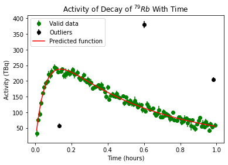
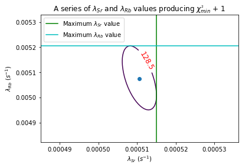

# Nuclear Decay Analysis - ⁷⁹Rb and ⁷⁹Sr Isotopes

This project analyzes the decay of the radioactive isotope ⁷⁹Rb, which is part of the decay chains of ⁷⁹Zr and ⁸¹Nb. The goal is to determine the decay constants and half-lives of both ⁷⁹Sr and ⁷⁹Rb using experimental data.

## Background

A 10⁻⁶ mole sample of ⁷⁹Sr was collected and observed as it decayed via β⁺ emission to ⁷⁹Rb, which subsequently decayed to ⁷⁹Kr, also via β⁺ emission, accompanied by a detectable γ ray. The γ emissions from the second step were the only measurable quantity, allowing indirect analysis of both decays.

CSV files were provided, which contain the measured activity values and their uncertainties, taken once per minute for one hour. Alongside the following theory, this data was then used to compute the nuclear decay constant for ⁷⁹Rb. 

## Theory

The radioactive decay of Sr follows an exponential law:

$N_{Sr}(t) = N_{Sr}(0) · exp(−λ_{Sr}·t)$,

where $λ_{Sr}$ denotes the radioactive decay constant for ⁷⁹Sr, and $Nₛᵣ(t)$ the number of ⁷⁹Sr nuclei at time $t$. 

Then, the decay of ⁷⁹Rb can be solved according to the differential equation:

$\frac{dN_{Rb}(t)}{dt} = -\lambda_{Rb} N_{Rb} + \lambda_{Sr} N_{Sr}$,

since $^{79}Sr$ decays to $^{79}Rb$. The arising solution to this is then given as: 

$N_{Rb}(t) = N_{Sr}(0) \cdot \frac{\lambda_{Sr}}{\lambda_{Rb} - \lambda_{Sr}} \cdot \left[ \exp(-\lambda_{Sr} t) - \exp(-\lambda_{Rb} t) \right]$.

Then, the activity of decay is given as: 

$A_{Rb}(t) = λ_{Rb} · N_{Rb}(t) = N_{Sr}(0) \cdot \frac{\lambda_{Rb}\lambda_{Sr}}{\lambda_{Rb} - \lambda_{Sr}} \cdot \left[ \exp(-\lambda_{Sr} t) - \exp(-\lambda_{Rb} t) \right]$.

Using a parameter grid of $\lambda_{Rb}$, $\lambda_{Sr}$ values, a non-linear χ² minimisation fit can be performed to approximate the decay constants of both $^{79}Rb$ and $^{79}Sr$.

Finally, the half-lives of each decay process may be calculated directly as: 

$t_{1/2} = \frac{\ln2}{\lambda}$.

## Results

With the input of the *Nuclear_data_1.csv* and *Nuclear_data_2.csv* files described above (but not included), the following results arise.

Clearly, the χ² minimisation on a parameter grid works well to approximate the activity function. It is found that $\chi_{min}^2 = 127.5$.

 \
*Here, the activity function corresponding with the $ \lambda_{Rb} $, $ \lambda_{Sr} $ values, generated from the program's χ² minimisation, is displayed in the red line. The raw data is plotted in the green points, alongside the uncertainties associated with each. The outliers - defined as points where the predicted function is three standard deviations away from the predicted function - are plotted in black. These do not contribute to the minimisation.*

An additional investigation into the $\lambda_{Rb}$, $\lambda_{Sr}$ values producing a *near*-minimised χ² value, at $\chi_{min}^2 + 1 = 128.5$, produced the following contour plot.

 \
*Here, the contour line corresponding to the pairs of values that fit the raw data with a χ² value of $128.5$ is displayed in purple. In cyan and green, the maximum $\lambda_{Rb}$, $\lambda_{Sr}$ values, respectively, are plotted.*

## Conclusions

